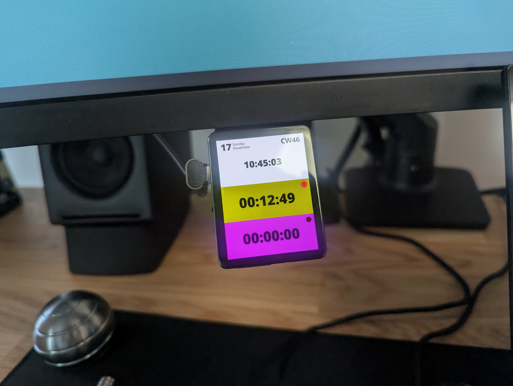

# time_tracker

A nifty little device I created with the goal of maintaining the sense of time at work
and helping myself with making my daily tasks and planning more effective.

## Description

The device is built around a [LilyGO T4 S3](https://lilygo.cc/products/t4-s3?variant=43235595649205) board and [LVGL](https://lvgl.io/).

Its current features include:
- Datetime
- Total and task time tracking
- Start, pause, reset time
- Automatic dimming
- Turn on/off screen

You can program the device with [PlatformIO](https://platformio.org/) in VSCode.

## Notes

It's work in progress...

- The firmware is complete in its current version.
- The enclosure is in a prototype stage and will be uploaded as soon as the design is refined.

In the meantime, you may read more about the story behind it [here](https://nlamprian.me/blog/software/network/2024/11/17/time-tracking/).
